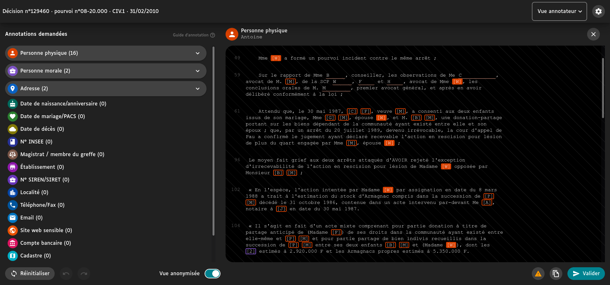

[EN](README.md) | **FR**

LABEL est un logiciel d'annotation de texte créé par la [Cour de cassation](https://www.courdecassation.fr/). Il est actuellement utilisé pour publier des décisions de justice dans le cadre de l'ouverture des données de la justice.

Cet outil permet aux annotateurs et annotatrices de relire et passer en revue les décisions qui ont été pré-annotées automatiquement par un algorithme.

## Historique

- 7 octobre 2016 : Loi n°2016-1321 pour une République numérique.
- Novembre 2017 : Rapport de la mission Cadiet
- 23 mars 2019 : Loi n°2019-222 de programmation 2018-2022 et de réforme de la justice.
- 29 juin 2020 : Décret n°2020-797 relatif à la mise à disposition du public des décisions des juridictions Judiciaires et administratives.
- Septembre 2020 : Le projet est lancé par [le programme Entrepeneur d'Intérêt Général (EIG)](https://eig.etalab.gouv.fr/defis/label/).
- Juin 2021 : Mise en production avec les décisions de la Cour de cassation (base de données Jurinet).

Prochaines étapes:

- Avril 2022 : Ajout des décisions des Cours d'appel en matière civile, sociale et commerciale (base de données JuriCA).
- Juin 2023 : Ajout des décisions des Conseils de prud'hommes.

Pour en savoir plus, [une roadmap est disponible](ROADMAP.md).

## Installation

Suivez le [guide d'installation](INSTALL.md).

## Logique métier

- [Liste des status de document](docs/documentStatuses.md).
- [Flux d'annotation](docs/annotationFlow.md).
- [Termes de remplacement](docs/replacementTerms.md).

## Comment réutiliser LABEL

LABEL a été conçu pour être réutiliser dans n'importe quel contexte d'annotation. Pour ce faire, nous disposons de deux sortes de packages :

- `specific` : ce qui est spécifique à la Cour de cassation (machine learning engine API, database connector, etc.)
- `generic` : tout ce qui n'est pas lié aux besoins propres à la Cour de cassation

Lisez [le guide de réutilisation](docs/reuserGuide.md) pour en savoir plus.
