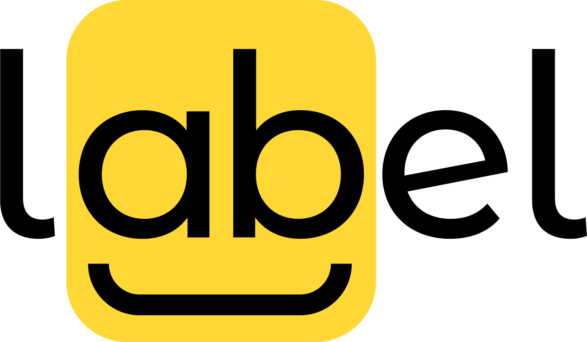
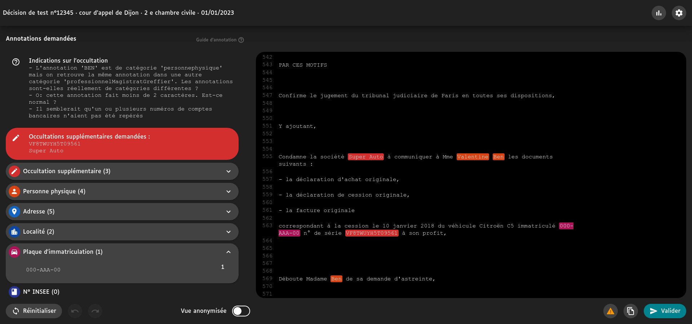
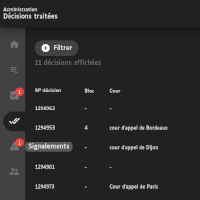
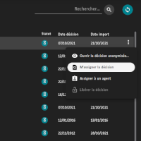
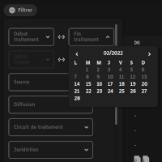
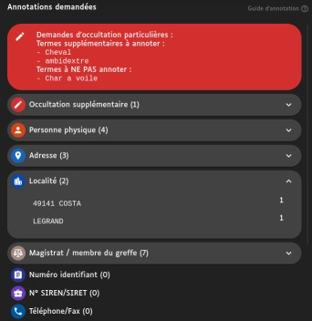
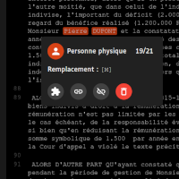
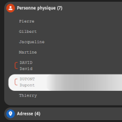

[EN](README.md) | **FR**

LABEL est un logiciel d'annotation de texte créé par la [Cour de cassation](https://www.courdecassation.fr/). Il est actuellement utilisé pour publier des décisions de justice dans le cadre de l'ouverture des données de la justice.

Cet outil permet aux annotateurs et annotatrices de relire et passer en revue les décisions qui ont été pré-annotées automatiquement par un algorithme.

## Fonctionnalités

### Côté administration

<section style="min-height:200px">

<h4 align="left">:paperclip: L'interface d'administration</h4>

Nous avons conçu une interface d'administration facile d'utilisation qui intègre de nombreuses fonctionnalité. Le premier onglet est dédié aux statistiques. Dans le deuxième onglet vous trouverez les documents à traiter. Le suivant rassemble les documents qui nécessitent une double relecture. Dans le quatrième onglet il y a les documents traités. Ensuite, nous avons les signalements envoyés par les annotateurs et annotatrices. Pour finir, vous pouvez gérer les comptes dans le dernier onglet.

</section>

---

<section style="min-height:200px">

<h4 align="right">:mag: Actions contextuelles & recherche</h4>

Pour chaque document, vous pouvez voir le document anonymisé, assigné le document à vous-même ou à un annotateur et même supprimé l'assignation (si par exemple le document doit être traité par un autre annotateur).

Vous avez peut-être remarqué que vous avez une barre de recherche. Vous pouvez entrer le numéro du document pour le trouver instantanément. Le bouton "rafraichir" met à jour la liste de documents avec les données les plus récentes.

</section>

---

<section style="min-height:200px">

<h4 align="left">:calendar: Filtres avancés</h4>

Vous pouvez filtrer la liste de documents. Il y a beaucoup de champ que vous pouvez filtrer. Par exemple, vous pouvez filter par date de traitement, par date d'import, par base de données source et bien d'autres. Les champs sont grisés lorsque les filtres ne trouvent pas les données correspondantes. Cela empêche les sélections vides.

Notez que vous pouvez classer le tableau en cliquant sur l'en-tête de chaque colonne.

</section>

---

 

### Annotators side

<section style="min-height:200px">

<h4 align="left">:pushpin: Annotations supplémentaires</h4>

Par défaut, LABEL permet des annotations de divers types: des numéros de téléphone, aux dates de naissance en passant par les numéros de comptes bancaires. Vous pouvez tout personnaliser et le champ "annotations supplémentaires" permet l'ajout d'annotations personnalisées qui ne rentre pas dans un type prédéfini. C'est très utile pour les demandes d'annotations non génériques comme les numéros de vol, les noms de chevaux, etc. par exemple.

</section>

---

<section style="min-height:200px">

<h4 align="right">:memo: Modifications dans le texte</h4>

Vous pouvez utiliser le panneau de gauche pour passer en revue les annotations, mais aussi directement depuis le texte. Les étiquettes sont interactives : vous pouvez changer le type de l'annotation, lier ou délier l'annotation ou même le supprimer. Bien sûr, vous pouvez ajouter d'autres étiquettes en sélectionnant directement le texte. Le logiciel vérifie la cohérence de vos modifications pour éviter les erreurs. Vous pouvez toujours revenir en arrière ou même réinitialiser vos modifications à n'importe quel moment.

</section>

---

<section style="min-height:200px">

<h4 align="left">:link: Annotations liées</h4>

LABEL permet de lier des annotations. Parfois les noms sont écrits en minuscule ou en lettres capitales. En les liants, les termes de remplacements seront identiques pour tous les noms (qu'ils soient en minuscule ou non). Cela permet une meilleure lisibilité des documents anonymisés.

</section>

---

Ceci est une liste non-exhaustive des fonctionnalités de LABEL. Contactez-nous si vous souhaiter une démo ou une présentation détaillée. Et oui, il y a de la traduction !

## Historique

- 7 octobre 2016 : Loi n°2016-1321 pour une République numérique.
- Novembre 2017 : Rapport de la mission Cadiet
- 23 mars 2019 : Loi n°2019-222 de programmation 2018-2022 et de réforme de la justice.
- 29 juin 2020 : Décret n°2020-797 relatif à la mise à disposition du public des décisions des juridictions Judiciaires et administratives.
- Septembre 2020 : Le projet est lancé par [le programme Entrepeneur d'Intérêt Général (EIG)](https://eig.etalab.gouv.fr/defis/label/).
- Juin 2021 : Mise en production avec les décisions de la Cour de cassation (base de données Jurinet).

Prochaines étapes:

- Avril 2022 : Ajout des décisions des Cours d'appel en matière civile, sociale et commerciale (base de données JuriCA).
- Juin 2023 : Ajout des décisions des Conseils de prud'hommes.

Pour en savoir plus, [une roadmap est disponible](ROADMAP.md).

## Installation

Suivez le [guide d'installation](INSTALL.md).

## Logique métier

- [Liste des status de document](docs/documentStatuses.md).
- [Flux d'annotation](docs/annotationFlow.md).
- [Termes de remplacement](docs/replacementTerms.md).

## Comment réutiliser LABEL

LABEL a été conçu pour être réutiliser dans n'importe quel contexte d'annotation. Pour ce faire, nous disposons de deux sortes de packages :

- `specific` : ce qui est spécifique à la Cour de cassation (machine learning engine API, database connector, etc.)
- `generic` : tout ce qui n'est pas lié aux besoins propres à la Cour de cassation

Lisez [le guide de réutilisation](docs/reuserGuide.md) pour en savoir plus.
