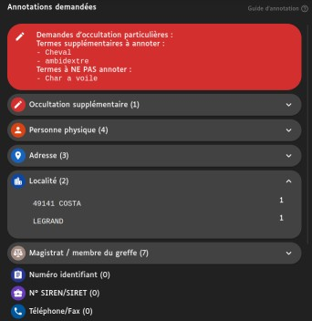
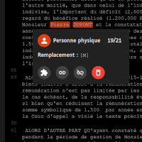

**EN** | [FR](README.fr.md)

LABEL is an open source text annotation software created by the [french supreme court 'Cour de cassation'](https://www.courdecassation.fr/). It is currently used for annotating court decisions for the [french justice open data project](https://www.courdecassation.fr/la-cour-de-cassation/demain/lopen-data-des-decisions-judiciaires).

This tool allows annotators to proofread and review decisions that have been pre-annotated by an NLP algorithm.

## Features

### Admin side

<section style="min-height:200px">

<h4 align="left">:paperclip: Admin panel</h4>

We have designed an easy-to-use administration interface that integrates many features. Here are the features available in the different tabs of the administration interface: consultation of statistics, lists of documents (to be processed, processed, documents requiring double review), list of reports, user management, management of document assignments.

</section>

---

<section style="min-height:200px">

<h4 align="right">:mag: Contextual actions & search</h4>

For each document, you can view the anonymized document, assign the document to yourself or to a chosen annotator and even remove the assignation (if for instance the document needs to be treated by another annotator).

You can also see that you have a search bar. You can type a document number to find it instantly. The refresh button updates the document list with the last available data.

</section>

---

<section style="min-height:200px">

<h4 align="left">:calendar: Advanced filters</h4>

You can filter the list of documents. There are many fields you can filter. For instance, you can filter by treatment date, by import date, by source database and more. The fields are grayed out if the filters cannot find data. This prevents empty selections.

Note that you can also sort the table by clicking on the columns' header.

</section>

---

 

### Annotators side

<section style="min-height:200px">

<h4 align="left">:pushpin: Supplementary annotations</h4>

By default, LABEL allows annotations of various types: phone numbers, dates of birth or bank account numbers for example. You can customize everything and the "additional annotations" field allows the addition of custom annotations that do not fit into a predefined type. This is very useful for non-generic annotation requests such as flight numbers, horse names, etc. for example. This field also allows you to flag specific terms that should not be annotated.

</section>

---

<section style="min-height:200px">

<h4 align="right">:memo: Inline editing</h4>

You can browse and edit annotations from the left panel, but also directly in the text. The labels are interactive: you can change annotation type, link or unlink the annotation or even delete it. Obviously, you can label other stuff by selecting them in the text. The software checks the consistency of your labeling to avoid mistakes. You can still go back or reset your modifications at any time.

</section>

---

<section style="min-height:200px">

<h4 align="left">:link: Linked annotations</h4>

LABEL allow you to link annotations. Sometimes names are written lowercase or in capitals. By linking them, the replacement terms will be the same (whether the names are in lowercase or not). This increases readability of anonymized documents.

</section>

---

This is a non-exhaustive review of LABEL's features. Contact us if you want a demo or a detailed presentation. And yes, we do i18n!

## History

- October 2016: French law for a Digital Republic.
- November 2017: Repport of Cadiet mission.
- 23 march 2019: Programmatic justice law 2018-2022.
- 29 june 2020: Decree about the publishing of court decision.
- September 2020: The project is initiated by the [Entrepeneur d'Intérêt Général (EIG) program](https://eig.etalab.gouv.fr/defis/label/).
- June 2021: Production launch with supreme court decisions (Jurinet database).
- April 2022: Addition of appeal court's decisions (JuriCA database).
- December 2023: Addition of 9 first judicial courts' decisions.
- During 2024-2025: Addition of other judicial courts' decisions.

Next steps:

- December 2024: Addition of industrial courts' decisions.
- Septembre 2025: Addition of labour courts' decisions and all first instance.

Learn more with [the roadmap](ROADMAP.md).

## Installation

Follow the [installation guide](INSTALL.md).

## Business logic index

- [List of document statuses](docs/documentStatuses.md).
- [Annotation flow](docs/annotationFlow.md).
- [Replacement terms](docs/replacementTerms.md).

## How to reuse LABEL

LABEL has been designed to be reused whatever the annotation context. There are two different kinds of packages in LABEL

- `specific`: what is specific to the Cour de cassation (machine learning engine API, database connector, etc.)
- `generic`: what is not linked to the specific needs of the Cour de cassation

Learn more in the [reuser guide](docs/reuserGuide.md).

## Authentication
<section style="min-height:200px">
LABEL integrates with the Pages Blanches SSO to facilitate user authentication using the SAML 2.0 protocol.

The diagram below illustrates the authentication flow.

1. When a user initiates access to LABEL, the frontend communicates with the backend to check the user’s authentication status. If the user is not authenticated, the backend initiates a redirect to the identity provider (IdP), passing the necessary authentication parameters.

2. The user is then prompted to log in via the SSO page. Upon successful authentication, the identity provider generates a SAML assertion and sends it to LABEL's backend via the Assertion Consumer Service (ACS) URL.

3. The backend processes and validates the SAML assertion to ensure data integrity and verify the authenticity of the digital signature

4. After validation, access to secured resources is granted, allowing the user to continue their authenticated session.

</section>