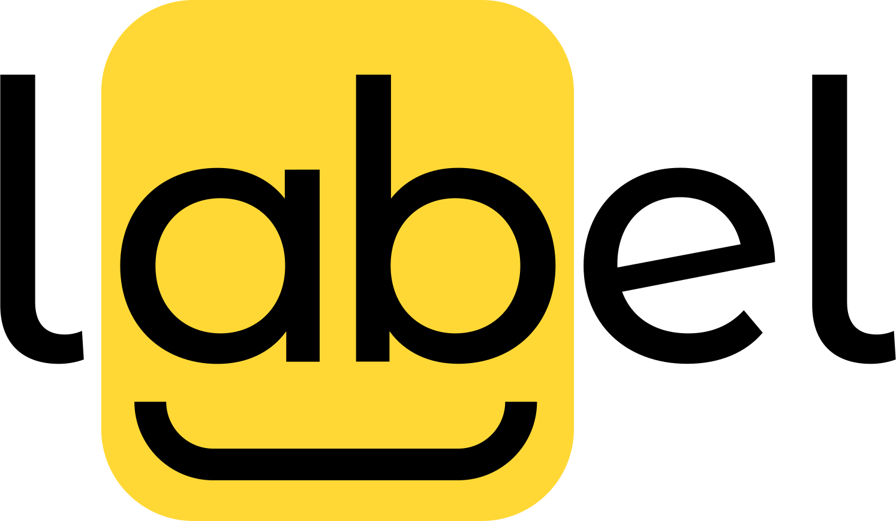
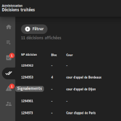
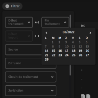
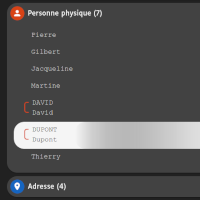

**EN** | [FR](README.fr.md)

LABEL is an open source text annotation software created by the [french supreme court 'Cour de cassation'](https://www.courdecassation.fr/). It is currently used for publishing court decisions in order to open justice data.

This tool allows annotators to proofread and review decisions that have been pre-annotated by an NLP algorithm.

## Features

### Admin side

<section style="min-height:200px">

<h4 align="left">:paperclip: Admin panel</h4>

We have designed a complete and easy to use admin panel. The first tab is dedicated to statistics. In the second tab you can find the documents ready to be treated. The next one is for documents that need to be double checked by admins before they are published. In the fourth tab there are treated documents. Next, we have all alerts sent by the annotators. Finally, you can manage accounts in the last tab.

</section>

---

<section style="min-height:200px">

<h4 align="right">:mag: Contextual actions & search</h4>

For each document, you can view the anonymized document, assign the document to yourself or to a chosen annotator and even remove the assignation (if for instance the document needs to be treated by another annotator).

You can also see that you have a search bar. You can type a document number to find it instantly. The refresh button updates the document list with the last available data.

</section>

---

<section style="min-height:200px">

<h4 align="left">:calendar: Advanced filters</h4>

You can filter the list of documents. There are many fields you can filter. For instance, you can filter by treatment date, by import date, by source database and more. The fields are grayed out if the filters cannot find data. This prevents empty selections.

Note that you can also sort the table by clicking on the columns' header.

</section>

---

 

### Annotators side

<section style="min-height:200px">

<h4 align="left">:pushpin: Supplementary annotations</h4>

By default, LABEL allows a great range of annotation types: from phone numbers, to birth dates and bank account numbers. You can customize everything and another field called "supplementary annotations" let you add custom annotations that does not belong to any annotation type. This is very useful if we have non-generic annotation requests like plane numbers, horse names or others.

</section>

---

<section style="min-height:200px">

<h4 align="right">:memo: Inline editing</h4>

You can browse and edit annotations from the left panel, but also directly in the text. The labels are interactive: you can change annotation type, link or unlink the annotation or even delete it. Obviously, you can label other stuff by selecting them in the text. The software checks the consistency of your labeling to avoid mistakes. You can still go back or reset your modifications at any time.

</section>

---

<section style="min-height:200px">

<h4 align="left">:link: Linked annotations</h4>

LABEL allow you to link annotations. Sometimes names are written lowercase or in capitals. By linking them, the replacement terms will be the same (whether the names are in lowercase or not). This increases readability of anonymized documents.

</section>

---

This is a non-exhaustive review of LABEL's features. Contact us if you want a demo or a detailed presentation. And yes, we do i18n!

## History

- October 2016: French law for a Digital Republic.
- November 2017: Repport of Cadiet mission.
- 23 march 2019: Programmatic justice law 2018-2022.
- 29 june 2020 : Decree about the publishing of court .
- September 2020 : The project is initiated by the [Entrepeneur d'Intérêt Général (EIG) program](https://eig.etalab.gouv.fr/defis/label/).
- June 2021 : Production launch with supreme court decisions (Jurinet database).

Next steps:

- April 2022 : Addition of appeal court's decisions (JuriCA database).
- June 2023 : Addition of industrial tribunals' decisions.

Learn more with [the roadmap](ROADMAP.md).

## Installation

Follow the [installation guide](INSTALL.md).

## Business logic index

- [List of document statuses](docs/documentStatuses.md).
- [Annotation flow](docs/annotationFlow.md).
- [Replacement terms](docs/replacementTerms.md).

## How to reuse LABEL

LABEL has been designed to be reused whatever the annotation context. There are two different kinds of packages in LABEL

- `specific`: what is specific to the Cour de cassation (machine learning engine API, database connector, etc.)
- `generic`: what is not linked to the specific needs of the Cour de cassation

Learn more in the [reuser guide](docs/reuserGuide.md).
