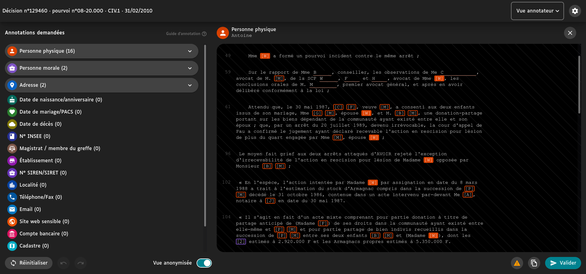

**EN** | [FR](README.fr.md)

LABEL is an open source text annotation software create by the [french supreme court 'Cour de cassation'](https://www.courdecassation.fr/). It is currently used for publishing court decisions in order to open justice data.

This tool allows annotators to proof read and review decisions that have been pre-annotate by an NLP algorithm.

## History

- October 2016: French law for a Digital Republic.
- November 2017: Repport of Cadiet mission.
- 23 march 2019: Programmatic justice law 2018-2022.
- 29 june 2020 : Decree about the publishing of court .
- September 2020 : The project is initiated by the [Entrepeneur d'Intérêt Général (EIG) program](https://eig.etalab.gouv.fr/defis/label/).
- June 2021 : Production launch with supreme court decisions (Jurinet database).

Next steps:

- April 2022 : Addition of appeal court's decisions (JuriCA database).
- June 2023 : Addition of industrial tribunals' decisions.

Learn more with [the roadmap](ROADMAP.md).

## Installation

Follow the [installation guide](INSTALL.md).

## Business logic index

- [List of document statuses](docs/documentStatuses.md).
- [Annotation flow](docs/annotationFlow.md).
- [Replacement terms](docs/replacementTerms.md).

## How to reuse LABEL

LABEL has been designed to be reused whatever the annotation context. There are two different kinds of packages in LABEL

- `specific`: what is specific to the Cour de cassation (machine learning engine API, database connector, etc.)
- `generic`: what is not linked to the specific needs of the Cour de cassation

Learn more in the [reuser guide](docs/reuserGuide.md).
