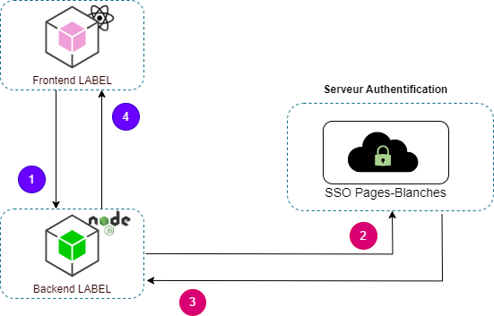

# Module SSO

Ce service implémente l'authentification unique (SSO) via **SAML 2** en de basant sur la bibliothèque `samlify`.  
Il gère l'authentification avec un fournisseur d'identité (IdP) tel que **Keycloak**, **Pages Blanches** ou tout autre fournisseur compatible SAML.  
Le service utilise la librairie **SAMLify** pour s'interfacer avec le SSO et faciliter la gestion des requêtes et des réponses SAML.

## Workflow

<section style="min-height:200px">

Le diagramme ci-dessous illustre l'interaction entre l'application Label et le SSO Pages Blanches pour l'authentification.



1. Lorsqu'un utilisateur accède à LABEL, le frontend interroge le backend pour vérifier son authentification. Si l'utilisateur n'est pas authentifié, le backend redirige vers le fournisseur d'identité (IdP) avec les paramètres nécessaires.

2. L'utilisateur se connecte sur la page SSO et, après authentification, le fournisseur d'identité génère et envoie une assertion SAML au backend de LABEL via l'URL de l'ACS.

3. Le backend valide l'assertion SAML pour garantir l'intégrité des données et la conformité de la signature numérique.

4. Après validation, l'accès aux ressources sécurisées est accordé, permettant à l'utilisateur de poursuivre sa session authentifiée.</section>
</section>

## Prérequis

- **Node.js** (version 16 ou plus récente)
- **SAMLify** : Bibliothèque pour gérer les interactions avec SAML 2.
- Un **Identity Provider (IdP)** compatible SAML 2.0 (par ex. Keycloak, Pages Blanches)
- Le fichier `sso_idp_metadata.xml` contient la configuration de l'Identity Provider.
- Le fichier `.env` contient les variables d'environnement nécessaires au fonctionnement du module.

## Configuration

### Configurer les variables d'environnement:

Les variables d'environnement nécessaires au fonctionnement du SSO sont présentes dans les fichier `docker.env.example` et `.env.example`

# Configuration du Service Provider (SP)

- SSO_SP_ENTITY_ID: Identifiant unique du SP (ie: SP-LABEL)
- SSO_SP_ASSERTION_CONSUMER_SERVICE_LOCATION: URL où le SP reçoit les assertions SAML après authentification
- SSO_SP_PRIVATE_KEY: Clé privée du Service Provider utilisée pour signer et déchiffrer les messages SAML échangés avec l'Identity Provider

### Génération d'une Clé Privée et d'un Certificat Auto-Signé pour SAML

Cette partie décrit les étapes nécessaires pour générer une clé privée et un certificat auto-signé à l'aide d'OpenSSL, qui peuvent être utilisés pour configurer un Service Provider (SP) dans un environnement SAML.

**Veuillez noter que l'utilisation de certificats auto-signés est généralement destinée aux environnements de développement ou de test. En production, il est fortement recommandé d'utiliser un certificat émis par une autorité de certification (CA) de confiance pour garantir la sécurité et la validité des communications.**

#### Prérequis

- **OpenSSL**: Assurez-vous qu'OpenSSL est installé sur votre système. Vous pouvez le télécharger et l'installer à partir du site officiel ou utiliser un gestionnaire de paquets.

#### Étapes de Génération

1. **Installer OpenSSL**:

```sh
   sudo apt-get update
   sudo apt-get install openssl
```

2. **Générer une Clé Privée**

```sh
   openssl genrsa -out privatekey.pem 2048
```

3. **Générer un Certificat Auto-Signé**

Utilisez la clé privée pour créer un certificat auto-signé

```sh
   openssl req -new -x509 -key privatekey.pem -out certificate.pem
```

Intégrez la clé privée ainsi que le certificat auto-signé dans la configuration de votre application.

# Configuration de l'Identity Provider (IdP)

- SSO_IDP_METADATA: Fichier XML contenant les métadonnées du IdP (Entity ID, certificats, endpoints).
- SSO_IDP_SINGLE_SIGN_ON_SERVICE_LOCATION: URL du SSO où le Service Provider redirige les utilisateurs pour l'authentification.
- SSO_IDP_SINGLE_LOGOUT_SERVICE_LOCATION: URL permettant la déconnexion des utilisateurs

## Fonctionnalités

### Génération des métadonnées

> La méthode **_generateMetadata()_** permet de générer et de récupérer les métadonnées du Service Provider (SP).

### Création d'une URL de demande de connexion

> La méthode **_createLoginRequestUrl()_** génère une URL pour initier la procédure de connexion via SAML 2.

### Analyse et traitement de la réponse SAML 2

> La méthode **_parseResponse()_** permet d'analyser et de traiter la réponse SAML reçue du IdP après une tentative de connexion.

### Création d'une URL de demande de déconnexion

> La méthode **_createLogoutRequestUrl(user)_** permet de créer une URL de déconnexion basée sur les informations d'utilisateur (nameID).

## Utilisation

L'exemple ci-dessous illustre l'utilisation du module SSO dans une application NestJs.

### Gestion de la session

Exemple d'implémentation de la gestion des sessions utilisateurs avec express-session.

```sh
npm install express-session
```

#### Configuration de la session

Dans votre application NestJS, procédez à la configuration d'express-session dans le fichier principal (par exemple, main.ts) comme suit :

```typescript
import { NestFactory } from "@nestjs/core";
import { AppModule } from "./app.module";
import * as session from "express-session";

async function bootstrap() {
  const app = await NestFactory.create(AppModule);

  app.use(
    session({
      secret: "votre_secret", // Remplacez par un secret fort
      resave: false,
      saveUninitialized: false,
      cookie: { secure: false }, // Mettez à true en production si vous utilisez HTTPS
    })
  );

  await app.listen(3000);
}
bootstrap();
```

#### Initialisation du service

Intégrez SamlService en l'injectant dans votre contrôleur ou service NestJS afin de l'utiliser de manière optimale.

```typescript
import { SamlService } from "./saml.service";

@Controller("auth")
export class AuthController {
  constructor(private readonly samlService: SamlService) {}

  @Get("login")
  async login(@Res() res: Response) {
    const loginUrl = await this.samlService.createLoginRequestUrl();
    return res.redirect(loginUrl);
  }

  @Post("sso/acs")
  async handleSSO(@Req() req: Request) {
    const response = await this.samlService.parseResponse(req);
    req.session.user = response; // Enregistrer l'utilisateur dans la session
    return response; // Traiter la réponse selon votre logique
  }

  @Get("logout")
  async logout(@Req() req: Request, @Res() res: Response) {
    const logoutUrl = await this.samlService.createLogoutRequestUrl(
      req.session.user
    );
    req.session.destroy(); // Détruire la session
    return res.redirect(logoutUrl);
  }
}
```

1. **Méthode de Connexion**

   Endpoint : **_GET /auth/login_**

   Cette méthode initie le processus de connexion en redirigeant l'utilisateur vers l'URL de demande de connexion SAML.

> ##### Fonctionnement
>
> Lorsqu'un utilisateur accède à l'endpoint /auth/login, la méthode login est appelée.
> La méthode utilise le service SAML (SamlService) pour générer une URL de demande de connexion.
> L'utilisateur est ensuite redirigé vers cette URL pour procéder à l'authentification.

2. **Méthode de Gestion des Réponses SSO**  
   Endpoint : **_POST /auth/sso/acs_**

   Cette méthode gère les réponses du SSO après que l'utilisateur se soit authentifié.

> #### Fonctionnement
>
> Lorsque l'utilisateur est authentifié, le SSO redirige vers l'endpoint /auth/sso/acs avec une réponse SAML.
> La méthode handleSSO est appelée, qui utilise le service SAML pour analyser la réponse.
> Les informations de l'utilisateur sont extraites de la réponse et stockées dans la session.

3. **Méthode de Déconnexion**  
   Endpoint : **_GET /auth/logout_**

   Cette méthode permet de déconnecter l'utilisateur et de gérer le processus de déconnexion avec le SSO.

> #### Fonctionnement
>
> Lorsque l'utilisateur souhaite se déconnecter, il accède à l'endpoint /auth/logout.
> La méthode logout est appelée, qui génère une URL de demande de déconnexion SAML.
> La session de l'utilisateur est détruite, et l'utilisateur est redirigé vers l'URL de déconnexion pour finaliser le processus.
